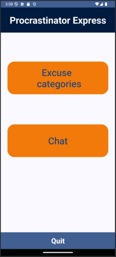
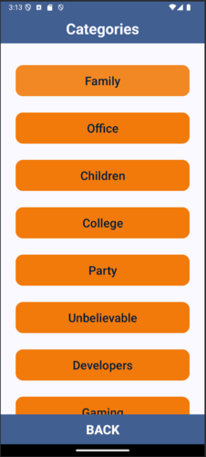
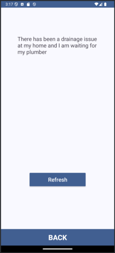

# ProcrastinatorExpress
<span style="font-size: 16px; font-style: italic;">Aplicatie care genereaza scuze in functie de domeniul sau pentru un input</span> 


<!-- TOC -->
<span style="font-size: 14px; font-weight: bold;">Cuprins</span> 
- [ProcrastinatorExpress](#procrastinatorexpress)
  - [Descriere Generala](#descriere-generala)
  - [Screenshots](#screenshots)
  - [Functionalitatea Aplicatiei](#functionalitatea-aplicatiei)
    - [Activitati (activities)](#activitati-activities)
    - [Servicii (services)](#servicii-services)
  - [Mod de Utilizare](#mod-de-utilizare)
  - [Tehnologii Utilizate](#tehnologii-utilizate)
  - [Structura Fisierelor](#structura-fisierelor)

<!-- /TOC -->

## Descriere Generala
**ProcrastinatorExpress** este o aplicatie Android conceputa pentru a genera scuze personalizate in functie de domeniul ales sau pentru un input furnizat de utilizator. Aceasta permite utilizatorilor sa selecteze o categorie de scuze (cum ar fi familie, birou, copii) sau sa solicite o scuza printr-un chat interactiv. Scuzele sunt obtinute fie dintr-un API extern de categorii, fie dintr-un serviciu de chat alimentat de modelul GPT.

## Screenshots






## Functionalitatea Aplicatiei

###  Activitati (activities)
1. **MainActivity**
    - Este ecranul principal al aplicatiei, care ofera urmatoarele optiuni utilizatorului:
        - Navigare catre lista de categorii („Category List”) printr-un buton.
        - Accesare sectiunea de chat interactiv („Chat”).
        - Oprirea aplicatiei printr-un buton "Quit" de inchidere.

2. **CatListActivity**
    - Prezinta o lista de categorii de scuze, fiecare reprezentata printr-un buton (ex.: family, office, children, college, ...).
    - Cand utilizatorul selecteaza o categorie, este redirectionat la `DetailActivity`, iar categoria selectata este transmisa printr-un „Intent”.
    - Include un buton "BACK" pentru revenirea la ecranul anterior.

3. **DetailActivity**
    - Afiseaza o scuza specifica pentru categoria selectata.
    - Utilizeaza serviciul `CategoryService` pentru a prelua scuza dintr-un API extern.
    - Ofera utilizatorului posibilitatea de a genera o alta scuza prin intermediul butonului „Refresh”.
    - Permite revenirea la lista de categorii prin intermediul butonului „BACK”.

4. **ChatActivity**
    - Ofera un mediu interactiv in care utilizatorul poate cere o scuza personalizata printr-un mesaj text.
    - Utilizeaza serviciul `ChatService` pentru a trimite mesajul utilizatorului catre un model GPT printr-un API de chat.
    - Raspunsurile primite sunt afisate in interfata aplicatiei.
    - Include buton "BACK" pentru revenirea la ecranul principal si buton "Generate" pentru generarea unei noi scuze.

### Servicii (services)
1. **CategoryService**
    - Este responsabil pentru obtinerea scuzelor dintr-un API extern (`https://excuser-three.vercel.app/v1/excuse/`).
    - Realizeaza cereri HTTP GET in mod asincron pentru a obtine scuza corespunzatoare categoriei selectate.
    - Ofera un callback pentru gestionarea rezultatelor:
        - „onSuccess”: Returneaza scuza preluata.
        - „onError”: Gestioneaza eventualele erori.
    - Parseaza raspunsul JSON pentru a extrage scuza utila.

2. **ChatService**
    - Comunica cu un API de chat GPT pentru a genera scuze personalizate.
    - Construieste cereri HTTP POST, incluzand mesaje de sistem si input-ul utilizatorului in format JSON.
    - Utilizeaza un API key stocat in fisierul de resurse (`api_key.xml`) pentru autentificare.
    - Parseaza raspunsul primit de la API pentru a afisa utilizatorului doar continutul relevant.

## Mod de Utilizare
1. Utilizatorul lanseaza aplicatia si alege:
    - **Excuse categories**: Selecteaza o categorie si primeste o scuza specifica acelui domeniu.
    - **Chat**: Introduce un mesaj(Ex.: Family, Office, ...) si primeste o scuza personalizata generata de modelul GPT.

2. Scuzele pot fi reimprospatate sau schimbate dupa preferinte.

3. Navigarea intre activitati este intuitiva, prin butoane dedicate(Ex.: Refresh, Generate).

## Tehnologii Utilizate
- **Nivel API Android**: Minim 26, pentru suportul functionalitatilor moderne precum Autosize TextViews.
- **API-uri externe**:
    - `https://excuser-three.vercel.app/v1/excuse/`: Pentru scuze bazate pe categorii.
    - `https://fresedgpt.space/v1/chat/completions`: Pentru scuze personalizate, folosind GPT.
- **Librarii utilizate**:
    - Conexiuni HTTP („HttpURLConnection”).
    - Manipulare JSON („org.json”).
- **Resurse**:
    - Layout-uri specifice pentru activitati (incarcate din `res/layout`).
    - Configurari de tema si culori (incarcate din `res/values`).

## Structura Fisierelor

```sh
ProcrastinatorExpress
 │   build.gradle
 │   gradle.properties
 │   settings.gradle
 │
 ├───app
 │   │   build.gradle
 │   │
 │   └───src
 │       └───main
 │           │   AndroidManifest.xml
 │           │
 │           ├───java
 │           │   └───ro
 │           │       └───example
 │           │           └───ProcrastinatorExpress
 │           │               │
 │           │               ├───activities
 │           │               │       MainActivity.java
 │           │               │		   CatListActivity.java
 │           │               │       DetailActivity.java
 │			     │				       │       ChatActivity.java
 │           │               │
 │           │               └───services
 │           │                       CategoryService.java
 │			     │						           ChatService.java
 │           │
 │           └───res
 │               ├───drawable
 │               │       ic_launcher.png
 │               │       ic_launcher_round.png
 │               │
 │               ├───layout
 │               │       activity_main.xml
 │               │       cat_list_activity.xml
 │               │       detail_activity.xml
 │			      	 │		   chat_activity.xml
 │               │
 │               ├───layout-land
 │               │       activity_main.xml
 │               │       cat_list_activity.xml
 │               │       detail_activity.xml
 │			      	 │		   chat_activity.xml
 │               │
 │               └───values
 │                       colors.xml
 │                       themes.xml
 │                       api_key.xml
 │
```

